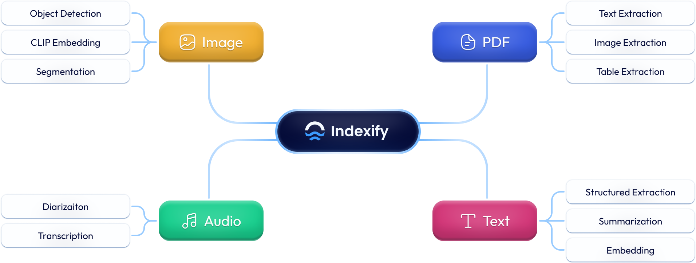

# Indexify


[](https://discord.gg/VXkY7zVmTD)

[Examples](examples) | [Indexify Extractors](https://github.com/tensorlakeai/indexify-extractors) | [Python Client](https://github.com/tensorlakeai/indexify-python-client) | [TypeScript Client](https://github.com/tensorlakeai/indexify-typescript-client)




> **LLM applications backed by Indexify will never answer outdated information.**

Indexify is an open-source engine for building fast data pipelines for unstructured data (video, audio, images and documents) using re-usable extractors for embedding, transformation and feature extraction. Indexify keeps vectordbs, structured databases (Postgres) updated automatically when pipelines produce embedding or structured data.

Applications can query indexes and databases using semantic search and SQL queries. 

## Differences with Batch/ETL Systems
ETL-based ingestion systems process files in batches, suitable for offline use cases with infrequent data updates. In contrast, Indexify’s pipelines function as live APIs, instantly processing files or text upon ingestion like any online system. Indexify efficiently schedules data processing tasks across thousands of machines, enabling real-time extraction for RAG applications or agents where up-to-date indexes are crucial.

## More Cool Features!

* **Incremental Extraction** when content is updated. Indexfiy processes only the chunks which have changed when documents, video or audio are updated.
* **Extractor SDK** allows plugging in any custom model or API in pipelines.
* Many pre-built extractors for embedding and handling **PDF**, **Image** and **Video**.
* Works with **any LLM Framework**. Built in support for **Langchain**, **DSPy**, etc.
* Runs locally for **prototyping** without any external dependencies.
* Works with many **Blob Stores**, **Vector Stores** and **Structured Databases**
* Automation to deploy to **Kubernetes** in production.


## Detailed Getting Started

To get started follow our [documentation](https://docs.getindexify.ai/getting-started-basic/).

## Quick Start
#### Download and start Indexify | Terminal1
```bash title="Terminal 1"
curl https://getindexify.ai | sh
./indexify server -d
```

#### Install the Indexify Extractor and Client SDKs | Terminal2
```bash title="Terminal 2"
virtualenv ve
source ve/bin/activate
pip install indexify indexify-extractor-sdk requests
```

#### Download some extractors | Terminal2
```bash title="Terminal 2"
indexify-extractor download tensorlake/minilm-l6
indexify-extractor download tensorlake/pdfextractor
indexify-extractor download tensorlake/yolo-extractor
indexify-extractor download tensorlake/chunk-extractor
indexify-extractor download tensorlake/summarization
indexify-extractor download tensorlake/whisper-asr
indexify-extractor join-server
```

### Text Embedding Pipeline
This example shows how to implement RAG on text
#### Create an Extraction Graph
```python
from indexify import IndexifyClient, ExtractionGraph
client = IndexifyClient()

extraction_graph_spec = """
name: 'sportsknowledgebase'
extraction_policies:
   - extractor: 'tensorlake/minilm-l6'
     name: 'minilml6'
"""
extraction_graph = ExtractionGraph.from_yaml(extraction_graph_spec)
client.create_extraction_graph(extraction_graph) 
print("indexes", client.indexes())
```
#### Add Texts
```python
content_ids = client.add_documents("sportsknowledgebase", ["Adam Silver is the NBA Commissioner", "Roger Goodell is the NFL commisioner"])
```

#### Retrieve
```python
client.wait_for_extraction(content_ids)
context = client.search_index(name="sportsknowledgebase.minilml6.embedding", query="NBA commissioner", top_k=1)
```

> The method wait_for_extraction blocks the client until Indexify runs the extraction on the ingested content. In production applications you will most likely won't block your application, and let extraction be asynchronous.

###  PDF Extraction and Retrieval
This example shows how to create a pipeline that extracts from PDF documents.
More information here - https://docs.getindexify.ai/usecases/pdf_extraction/

#### Create an Extraction Graph
```python
from indexify import IndexifyClient, ExtractionGraph
import requests
client = IndexifyClient()

extraction_graph_spec = """
name: 'pdfqa'
extraction_policies:
   - extractor: 'tensorlake/pdfextractor'
     name: 'docextractor'
"""

extraction_graph = ExtractionGraph.from_yaml(extraction_graph_spec)
client.create_extraction_graph(extraction_graph)
```

#### Upload a Document
```python
with open("sample.pdf", 'wb') as file:
  file.write((requests.get("https://extractor-files.diptanu-6d5.workers.dev/scientific-paper-example.pdf")).content)
content_id = client.upload_file("pdfqa", "sample.pdf")
```

#### Get Text, Image and Tables
```python
client.wait_for_extraction(content_id)
print(client.get_extracted_content(content_id, "pdfqa", "docextractor"))
```

### Audio Transcription and Summarization

This example shows how to transcribe audio, and create a pipeline that embeds the transcription 
More details about Audio Use Cases - https://docs.getindexify.ai/usecases/audio_extraction/

#### Create an Extraction Graph
```python
from indexify import IndexifyClient, ExtractionGraph
import requests
client = IndexifyClient()

extraction_graph_spec = """
name: 'audiosummary'
extraction_policies:
   - extractor: 'tensorlake/whisper-asr'
     name: 'transcription'
   - extractor: 'tensorlake/summarization'
     name: 'summarizer'
     input_params:
        max_length: 400
        min_length: 300
        chunk_method: str = 'recursive'
     content_source: 'transcription'
   - extractor: 'tensorlake/minilm-l6'
     name: 'minilml6'
     content_source: 'summarizer'
"""

extraction_graph = ExtractionGraph.from_yaml(extraction_graph_spec)
client.create_extraction_graph(extraction_graph)
```

#### Upload an Audio
```python
with open("sample.mp3", 'wb') as file:
  file.write((requests.get("https://extractor-files.diptanu-6d5.workers.dev/sample-000009.mp3")).content)
content_id = client.upload_file("audiosummary", "sample.mp3")
```

> Adding Texts and Files can be a time consuming process and by default we allow asynchronous ingestion for parallel operations. However the following codes might fail until the extraction has been completed. To make it a blocking call, use `client.wait_for_extraction(content_id)` after getting the content_id from above.

#### Retrieve Summary
```python
client.wait_for_extraction(content_id)
print("transcription ----")
print(client.get_extracted_content(content_id, "audiosummary", "transcription"))
print("summary ----")
print(client.get_extracted_content(content_id, "audiosummary", "summarizer"))
```

#### Search Transcription Index
```python
context = client.search_index(name="audiosummary.minilml6.embedding", query="President of America", top_k=1)
```

### Object Detection on Images
This example shows how to create a pipeline that performs object detection on images using the Yolo extractor.
More details about Image understanding and retrieval - https://docs.getindexify.ai/usecases/image_retrieval/

#### Create an Extraction Graph
```python
from indexify import IndexifyClient, ExtractionGraph
import requests

client = IndexifyClient()

extraction_graph_spec = """
name: 'imageknowledgebase'
extraction_policies:
   - extractor: 'tensorlake/yolo-extractor'
     name: 'object_detection'
"""

extraction_graph = ExtractionGraph.from_yaml(extraction_graph_spec)
client.create_extraction_graph(extraction_graph)
```

#### Upload Images
```python
with open("sample.jpg", 'wb') as file:
  file.write((requests.get("https://extractor-files.diptanu-6d5.workers.dev/people-standing.jpg")).content)
content_id = client.upload_file("imageknowledgebase", "sample.jpg")
```

#### Retrieve Features of an Image
```python
client.wait_for_extraction(content_id)
client.get_extracted_content(content_id, "imageknowledgebase", "object_detection")
```

> The Yolo extractor adds the objects detected in the image in the database. The table name is same as the extraction graph name

#### Query using SQL
```python
print(client.sql_query("select * from imageknowledgebase where object_name='person';"))
```

### LLM Framework Integration 
Indexify can work with any LLM framework, or with your applications directly. We have an example of a Langchain application [here](https://docs.getindexify.ai/integrations/langchain/python) and DSPy [here](https://docs.getindexify.ai/integrations/dspy/python).

### Try out other extractors
We have a ton of other extractors, you can list them and try them out - 
```bash
indexify-extractor list
```

### Custom Extractors
Any extraction or transformation algorithm can be expressed as an Indexify Extractor. We provide an SDK to write your own. Please follow [the docs here for instructions](https://docs.getindexify.ai/apis/develop_extractors/). 

### Structured Data

Extractors which produce structured data from content, such as bounding boxes and object type, or line items of invoices are stored in
structured store. You can query extracted structured data using Indexify's SQL interface.

We have an example [here](https://docs.getindexify.ai/usecases/image_retrieval/)

## Contributions
Please open an issue to discuss new features, or join our Discord group. Contributions are welcome, there are a bunch of open tasks we could use help with! 

If you want to contribute on the Rust codebase, please read the [developer readme](docs/docs/develop.md).
