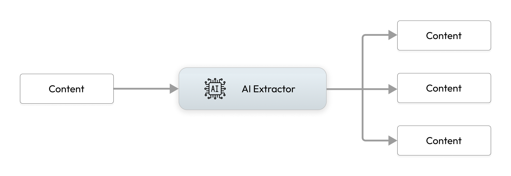

# Extractors

Extractors are used for structured extraction from un-structured data of any modality. For example, line items of an invoice as JSON, objects in a video, embedding of text in a PDF, etc. 

## Extractor Input and Ouput 

Extractors consume `Content` which contains raw bytes of unstructured data, and they produce a list of Content and features from them. 
For example, a PDF document could be broken down to - images, multiple text chunks, tabular data encoded as JSON, embeddings of the text chunks, each would be encoded as a Content and emitted by the extractor. Indexify stores raw bytes into blob store and features such as embeddings or JSON documents into indexes for retreival. 



Extractors are typically built using AI model and some additional pre and post processing of content.

## Running Extractors

### From Source Code
```shell
indexify extractor extract --extractor-path </path/to/extractor_file.py:ClassNameOfExtractor> --text "hello world"
```
This will invoke the extractor in `extractor_file.py` and create a `Content` with *hello world* as the payload. 

If you want to pass in the contents of a file into the payload use `--file </path/to/file>`

### From Packaged Containers

Extractors are packaged in docker containers so they can be tested locally for evaluation and also deployed in production with ease.

```shell
indexify extractor extract --name diptanu/minilm-l6-extractor --text "hello world"
```
