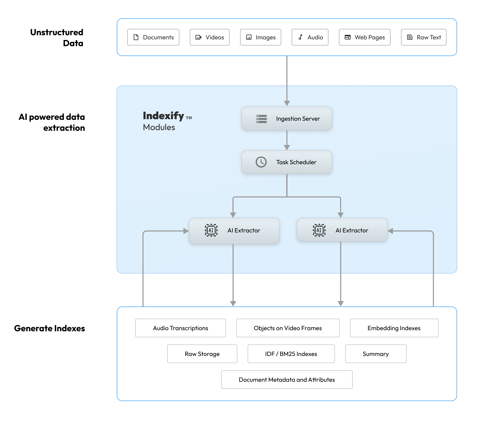

# Key Concepts

A typical workflow using Indexify involves adding content, wait for vector or JSON document indexes to be updated as extractors run on the content. As indexes are updated continously, you could retrieve updated information from them, via semantic search, K/V lookup or JSON path queries.

## Content
Unstructured data ingested into Indexify or produced within the service by transforming ingested content. Ex - PDF, Videos, Images, Text. Content produced by transforming a source content has their lineage tracked to the source. For example a PDF document could be transformed by the system into Text, Images and JSON documents.

## Index and Retreival APIs
Indexes store extracted information from unstructured data, that can be either 1. Looked up with IDs 2. Searched semantically in the case of embedding indexes, or exact search in case of lucene indexes or using JSON path queries incase of JSON documents.

## Extractor
A python class that can -
1. Transform unstructured data into intermediate forms. For example, a PDF document transformed into text, images, structured data if it contains tabular data.
2. Extract features like embedding or metadata(JSON) that goes into various indexes that can be retreived by LLM applications.

## Extractor Bindings
Applies extractors in a streaming fashion to ingested or derived unstructured content, and Indexes are automatically updated with the extracted data. Think of bindings as calls to extractors, they are long lived and are being called every time there is new content in the system.

## Namespaces
Namespaces are logical abstractions for storing related content. Namespaces allow partitioning data based on security and organizational boundaries.