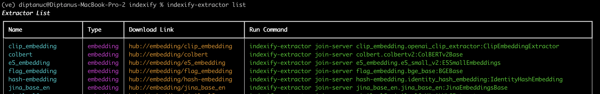

# Command Line Interface

Indexify has two CLIs, `indexify-extractor` for running and testing the Extractors. And a CLI to run the server. If you want to learn about the CLI interface of the server, please read (Operating Indexify)[https://getindexify.ai/configuration/]

## Indexify Extractor CLI

Download the indexify-extractor cli by -
```
pip install indexify-extractor
```

#### List Available Extractors
```python
indexify-extractor list
```


#### Download Extractors
The extractors has to be downloaded before they can be used locally or in production. For ex, you can download the PDF extractor like this - 
```bash
indexify-extractor download tensorlake/pdf-extractor
```

#### Test Extractors Locally 
You can test extractors locally without running them with the server in a production setting.
Let's say we want to test the PDF extractor 

```bash
indexify-extractor run-local pdf-extractor.pdf_extractor:PDFExtractor --file /path/to/pdf
```

###### Options 
- `--file` to pass in a file to the extractor
- `--text` to pass in text to the extractor

#### Join the Extractor to the Server 
You can join the extractor to the server to start extracting data ingested by the server
```bash
indexify-extractor join-server
```
###### Options
- `--coordinator-addr` - Address of the coordinator. Default: `localhost:8950`
- `--ingestion-addr` - Address of the ingestion server. Default: `localhost:8900`
- `--listen-port` - The port on which the extractor listens of on-demand extraction
- `--advertise-addr` - The address that is advertized to the ingestion server. This should be reachable by the server for embedding lookups to work if this is an embedding extractor.
- `--workers` - Number of workers that the extractor spawns

These configurations are printed in log when the extractor starts up

