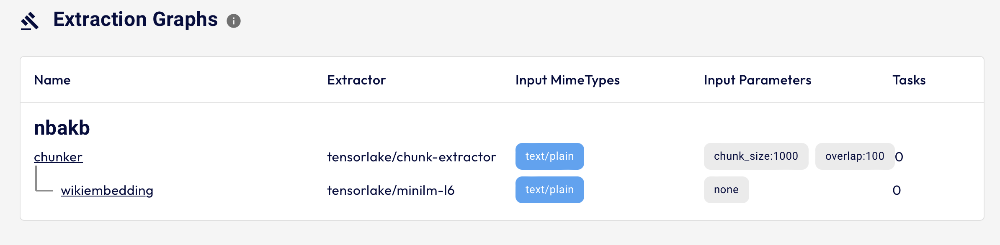

# Getting Started

We will build a few applications to demonstrate how to create LLM applications capable of making decisions or providing answers based on unstructured data. You will design declarative extraction graphs(real-time labeling and extraction data pipelines) that can automatically extract information from unstructured data. 

Indexify will automatically generate Vector Indexes if any embeddings are produced. Any structured data generated during extraction will be written into structured stores.

!!! note "Storage"
    Indexify uses LanceDB for storing embedding and sqlite3 for storing structured data, when it's run locally on laptops in the "dev" mode. You can use one of the many supported vector stores, and structured stores by specifying a custom configuration file.

- Create a chat bot that can answer questions about NBA players based on information on Wikiepdia
- Ingest a [PDF file](https://ak-static.cms.nba.com/wp-content/uploads/sites/4/2023/06/2023-NBA-Collective-Bargaining-Agreement.pdf) which contains ther rules that govern salary and player trading between teams.
  
### Download and Start Indexify Server

```shell
curl https://getindexify.ai | sh
```
Once the binary is downloaded, start the server in development mode.
```shell
./indexify server -d
```

This starts the Indexify ingestion API and scheduler. The server state, ingested and extract content will be stored on local disk. The following endpoints are started -

- Ingestion API ([http://localhost:8900](http://localhost:8900)) - The API endpoint for uploading content and retrieve from indexes and SQL Tables.
- User Interface ([http://localhost:8900/ui](http://localhost:8900/ui)) - Dashboard for extraction graphs, content and indexes.

!!! note ""
    A internal scheduler endpoint is started at localhost:8950 for communicating with extractors.

### Install the Extractor SDK

Extraction from unstructured data is done through Extractors. Install some extractors to get started. Open another shell, download some extractors.

!!! note "Tip"
    Create a virtualenv or miniconda environment to install any Python library you will be downloading and using to do this getting started exercise. 
    ```shell
    virtualenv ve
    source ve/bin/activate
    ```

```bash
pip install indexify-extractor-sdk
indexify-extractor download hub://embedding/minilm-l6
indexify-extractor download hub://text/chunking
```

Once the extractor SDK and extractors are downloaded, start and join them to the Indexify Control Plane. This is a long running process that extracts continuously when new data is ingested.

```bash
indexify-extractor join-server
```

### Install the client library

Indexify comes with Python and Typescript clients for ingesting unstructured data and retrieving indexed content. These clients use the HTTP APIs of Indexify under the hood.

=== "python"
    ```bash
    pip install indexify
    ```
=== "TypeScript"

    ```bash
    npm install getindexify
    ```

### Building the Chat Bot 
Building a chatbot is a three step process -

- Create an Extraction Graph to transform content into searchable vector indexes and structured data.
- Retrieve relevant information from the index, based on the question.
- Use an LLM to generate a response.

Create a file to write your application. In this tutorial we will create the extraction graph, ingestion and querying in a single application file, for real production usecases these aspects will probably live in separate components of your application.

=== "python"
    Create a file app.py
=== "typescript"
    Create a file app.ts

##### Create an Extraction Graph
Extraction Graphs allow you to create real time data pipelines that extract structured data or embeddings from unstructured data like documents or videos.

We create an extraction graph named `nbakb`. It instructs Indexify to do the following when any new content is added to this graph -

- Chunks texts.
- Runs them through an embedding model.
- Writes the embedding into a vector database.

=== "Python"
    ```python
    from indexify import IndexifyClient, ExtractionGraph 
    
    client = IndexifyClient()
    
    extraction_graph_spec = """
    name: 'nbakb'
    extraction_policies:
       - extractor: 'tensorlake/chunk-extractor'
         name: 'chunker'
         input_params:
            chunk_size: 1000
            overlap: 100
       - extractor: 'tensorlake/minilm-l6'
         name: 'wikiembedding'
         content_source: 'chunker'
    """

    extraction_graph = ExtractionGraph.from_yaml(extraction_graph_spec)
    client.create_extraction_graph(extraction_graph)                                            
    ```
=== "TypeScript"
    ```typescript
    import { IndexifyClient } from "getindexify";
    
    const client = await IndexifyClient.createClient();
    ```
At this point, if you visit the [UI](http://localhost:8900/ui) you will see an extraction graph being created.


#### Vector Indexes 
Extraction Graphs automatically creates and updates vector indexes if one or more extractors in the graph produces embedding as output. Indexify takes care of updating these indexes for you automatically when new embeddings are created. 

You can list all the vector indexes in a given namespace.

=== "python"
    ```python
    print(client.list_indexes())
    ```
=== "typescript"
    ```typescript
    ```


##### Adding Content
You can now add content to the extraction graph. Indexify will start running the graph whenever new content is added.
=== "python"
    ```python
    from langchain_community.document_loaders import WikipediaLoader
    docs = WikipediaLoader(query="Kevin Durant", load_max_docs=1).load()
    for doc in docs:
        client.add_documents("nbakb", doc.page_content)                 
    ```

=== "TypeScript"
    ```typescript
    ```


!!! note "Outcome"
    We now have an index, with texts from wikipedia chunked and embedded by MiniLML6.

##### RAG for Question Answering

We can use RAG to build the chatbot. We will retrieve data from the indexes, based on the question, and add them into the context of an LLM request to generate an answer. You can use any LLMs - OpenAI, Cohere, Anthropic or local models using LLama.cpp, Ollama or Hugginface.

```shell
pip install openai
```

Write a function that retrieves context for your RAG application
```python
def get_context(question: str, index: str, top_k=3):
    results = client.search_index(name=index, query=question, top_k=3)
    context = ""
    for result in results:
        context = context + f"content id: {result['content_id']} \n\n passage: {result['text']}\n"
    return context

def create_prompt(question, context):
    return f"Answer the question, based on the context.\n question: {question} \n context: {context}"
```

Thats pretty much all you need to create a Basic RAG application that relies only on vector indexes

You can now use LLM to generate responses based on questions and the retrieved context:

```python
from openai import OpenAI
client_openai = OpenAI()

question = "When and where did Kevin Durant win NBA championships?"
context = get_context(question, "nbakb.wikiembedding.embedding")
prompt = create_prompt(question, context)

chat_completion = client_openai.chat.completions.create(
    messages=[
        {
            "role": "user",
            "content": prompt,
        }
    ],
    model="gpt-3.5-turbo",
)
print(chat_completion.choices[0].message.content)
```
!!! note "Response"
    Kevin Durant won his championships with the Golden State Warriors in 2017 and 2018.

### Next Steps
Now that you have learnt how to use Indexify, you can follow along to learn the following topics -

- Learn more about PDF, Video and Audio Extraction Use Cases.
- Integration with Langchain and DSPy if you use these frameworks.
- Deployment on Kubernetes
- Observability and understanding performance of Retreival and Extraction processes.