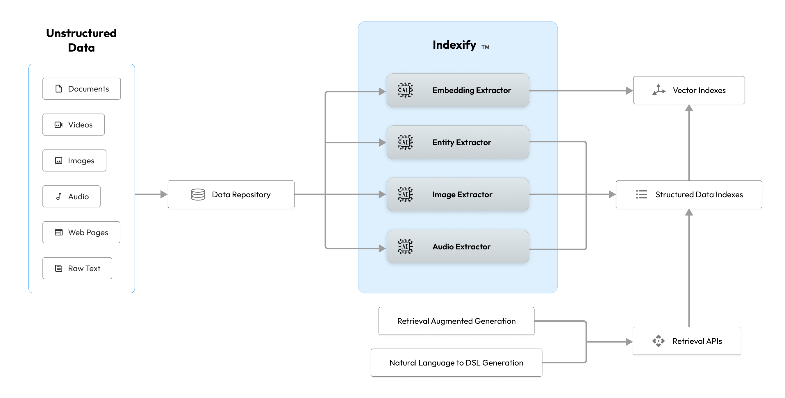

# Indexify

## Production Ready Multi-Modal Compute Engine for Large Language Models Applications

Indexify is a reactive structured extraction engine for un-structured data such as PDFs, raw text, audio and video.

Applications leveraging LLMs for autonomous planning or queries necessitate timely index updates aligned with data changes or new extraction methods. Indexify enables both, by applying feature extractors on data in real-time and updating one or many indexes.

Storage is pluggable, we support few different vector stores for embeddings and document stores for structured data.

## Why use Indexify

* **Knowledge Base for LLMs:** Real-time retrieval of knowledge and context from private documents and structured data to improve the accuracy of LLM models.
* **Distributed Extraction Engine For Scale:** Distributed extraction to scale indexing large amounts of data without sacrificing retrieval performance.
* **Custom Extractors:** You can extend Indexify by writing a custom extractor for your use cases to extract specific information from data.
* **Pluggable Storage:** Easily add support for new storage backends.

## Start Using Indexify

Dive into [Getting Started](getting_started.md) to learn how to use Indexify.
