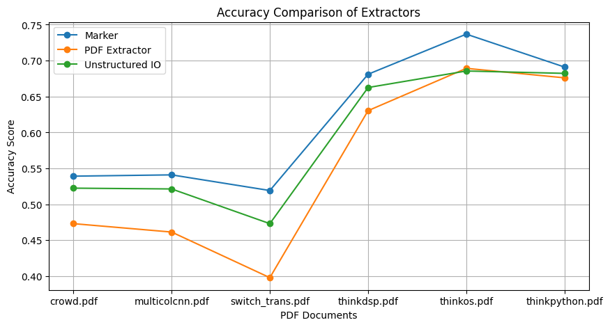
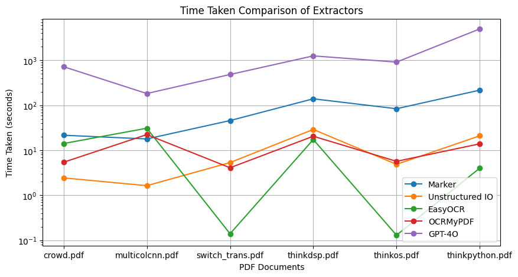
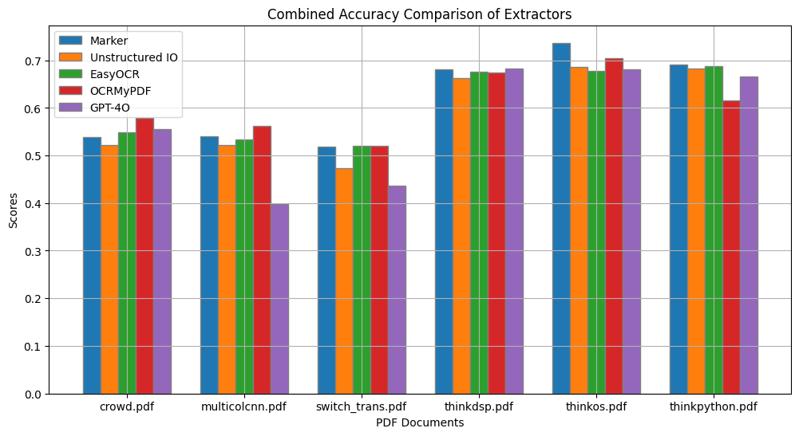

# PDF Extraction

Indexify provides several extractors that extract text, images, and tables from PDF documents. Some extractors also convert PDFs to markdown documents. You can build complex pipelines that can extract and write tabular information from PDF documents in structured stores or extract embedding from texts in the documents. 


## What Can You Achieve with Indexify?

With Indexify, you can accomplish the following with your PDFs:

1. 🔍 **Data Extraction:** Extract specific information from PDFs such as text, images and tables.
2. 📚 **Document Indexing:** Build searchable indexes on vector stores and structured stores by combining PDF extractors with chunking, embedding, and structured data extractors. 
3. 🤖 **Document Q&A:** Get Answers to specific Questions from Documents directly. 

## The Extraction Pipeline: A Three-Stage Process

PDF Extraction Pipelines are usually composed of three stages. You can use one or more of these stages depending on your use case - 

1. **Content Extraction Stage:** Extract raw content from your PDFs using extractors like `pdf/pdfextractor` or `pdf/markdown`. These extractors will retrieve text, images, and tables from your documents.
If all you want is to extract text, images, and tables from a PDF, this is the only stage you need in an extraction graph. 

2. **Text Chunking:** Chunk any extracted text using the `text/chunking` extractor. You can write custom chunkers by following [this guide](https://docs.getindexify.ai/apis/develop_extractors/).
3. **Chunk to Embedding Extraction Stage:** Convert the chunks into vector embeddings using extractors like `embedding/minilm-l6` or `embedding/arctic`. 

## Image Extraction
If you would like to extract images from PDF, the best extractor to use is `tensorlake/pdfextractor` It automatically extracts images from documents and writes them into blob stores. 

You can get extracted images from pdfextractor by simply specifying ["image"] in the graph like this:
```python
extraction_graph_spec = """
name: 'image_extractor'
extraction_policies:
  - extractor: 'tensorlake/pdfextractor'
    name: 'pdf_to_image'
    input_params:
      output_types: ["image"]
"""
```
Complete code:
1. Define Graph by running [image_pipeline.py](https://github.com/tensorlakeai/indexify/blob/main/docs/docs/usecases/image/image_pipeline.py)
2. Test Image extraction by running [upload_and_retreive.py](https://github.com/tensorlakeai/indexify/blob/main/docs/docs/usecases/image/upload_and_retreive.py)

## Table Extraction
Tables are automatically extracted by `tensorlake/pdfextractor` as JSON metadata. You can query the metadata associated with documents by calling the Retrieval APIs. 

You can get extracted tables from pdfextractor by simply specifying ["table"] in the graph like this:
```python
extraction_graph_spec = """
name: 'table_extractor'
extraction_policies:
  - extractor: 'tensorlake/pdfextractor'
    name: 'pdf_to_table'
    input_params:
      output_types: ["table"]
"""
```
Complete code:
1. Define Graph by running [table_pipeline.py](https://github.com/tensorlakeai/indexify/blob/main/docs/docs/usecases/table/table_pipeline.py)
2. Test Table extraction by running [upload_and_retreive.py](https://github.com/tensorlakeai/indexify/blob/main/docs/docs/usecases/table/upload_and_retreive.py)

## Explore PDF Extractors

Here's a quick overview of all the extractors:

| Extractors                                | Output Type        | Best For                            | Output Example                                                                                                                                                                                                                                                                                                                                                                                                                                                                 |
|-------------------------------------------|--------------------|-------------------------------------|--------------------------------------------------------------------------------------------------------------------------------------------------------------------------------------------------------------------------------------------------------------------------------------------------------------------------------------------------------------------------------------------------------------------------------------------------------------------------------|
| tensorlake/layoutlm-document-qa-extractor | metadata           | Invoices Question Answering         | [Feature(feature_type='metadata', name='metadata', value={'query': 'What is the invoice total?', 'answer': '$93.00', 'page': 0, 'score': 0.9743825197219849}, comment=None)]                                                                                                                                                                                                                                                                                                   |
| tensorlake/pdfextractor                  | text, image, table | Scientific Papers with Tabular Info | [Content(content_type='text/plain', data=b'I love playing football.', features=[Feature(feature_type='metadata', name='text', value={'page': 1}, comment=None)], labels={})]                                                                                                                                                                                                                                                                                                   |
| tensorlake/ocrmypdf                       | text               | Photocopied/Scanned PDFs on CPU     | [Content(content_type='text/plain', data=b'I love playing football.', features=[Feature(feature_type='metadata', value={'page': 1}, comment=None)], labels={})]                                                                                                                                                                                                                                                                                                                |
| tensorlake/easyocr                        | text               | Photocopied/Scanned PDFs on GPU     | [Content(content_type='text/plain', data=b'I love playing football.', features=[Feature(feature_type='metadata', name='text', value={'page': 1}, comment=None)], labels={})]                                                                                                                                                                                                                                                                                                   |
| tensorlake/marker                         | text, table        | Detailed structured & formatted PDF | [Content(content_type='text/plain', data=b'I love playing football.', features=[Feature(feature_type='metadata', name='text', value={'language': 'English', 'filetype': 'pdf', 'toc': [], 'pages': 1, 'ocr_stats': {'ocr_pages': 0, 'ocr_failed': 0, 'ocr_success': 0}, 'block_stats': {'header_footer': 2, 'code': 0, 'table': 0, 'equations': {'successful_ocr': 0, 'unsuccessful_ocr': 0, 'equations': 0}}, 'postprocess_stats': {'edit': {}}}, comment=None)], labels={})] |

## Get Started with PDF Extraction

You can test it locally:

1. Download a PDF Extractor:
   ```bash
   indexify-extractor download tensorlake/pdfextractor
   indexify-extractor join-server
   ```

2. Load it in a notebook or in a Python script:
   ```python
   from indexify_extractor_sdk import load_extractor, Content

   extractor, config_cls = load_extractor("indexify_extractors.pdfextractor.pdf_extractor:PDFExtractor")
   content = Content.from_file("/path/to/file.pdf")

   results =  extractor.extract(content)
   print(results)
   ```


## Continuous PDF Extraction for Applications

Here is an example of how you can create a pipeline that extracts text, tables and images from a PDF document.

1. Start the Indexify Server:
   ```bash
   curl https://getindexify.ai | sh
   ./indexify server -d
   ```

2. Start a long-running PDF Extractor:
   ```bash
   indexify-extractor download tensorlake/pdfextractor
   indexify-extractor join-server
   ```

3. Create an Extraction Graph:
   ```python
   from indexify import IndexifyClient, ExtractionGraph
   client = IndexifyClient()

   extraction_graph_spec = """
   name: 'pdfknowledgebase'
   extraction_policies:
      - extractor: 'tensorlake/pdfextractor'
        name: 'pdf_to_text'
   """

   extraction_graph = ExtractionGraph.from_yaml(extraction_graph_spec)
   client.create_extraction_graph(extraction_graph)
   ```

4. Upload PDFs from your application:
   ```python
   content_id = client.upload_file("pdfknowledgebase", "/path/to/pdf.file")
   ```

5. Inspect the extracted content:
   ```python
   client.wait_for_extraction(content_id)
   extracted_content = client.get_extracted_content(content_id=content_id, graph_name="pdfknowledgebase", policy_name="pdf_to_text")
   print(extracted_content)
   ```

You can extend the graph to do any kind of downstream tasks(embedding, summarization, etc) once you have data out of PDF. 

## Explore More Examples

We've curated a collection of PDF extraction examples. Check out these notebooks:

- [PDF Translation (Uses OpenAI)](https://docs.getindexify.ai/examples/openai_pdf_translation)
- [PDF Summarization (Uses Mistral)](https://docs.getindexify.ai/examples/mistral/pdf-summarization-cookbook)
- [PDF Entity Extraction (Uses Mistral)](https://docs.getindexify.ai/examples/mistral/pdf-entity-extraction-cookbook)
- [PDF Chunk Extraction](https://docs.getindexify.ai/examples/chunking)


## Extractor Performance Analysis

PDF is a complex data type, we recommend you try out all extractors on a representative sample of documents that you are extracting from, and decide which extractors to use in your pipeline. We present some code to benchmark the various extractors.

### Category: Scientific Papers and Books

1. [crowd.pdf](https://github.com/tensorlakeai/indexify-extractors/raw/main/pdf/benchmark/pdfs/crowd.pdf) - Reference: [crowd.md](https://raw.githubusercontent.com/tensorlakeai/indexify-extractors/main/pdf/benchmark/references/crowd.md) (10 pages)
2. [multicolcnn.pdf](https://github.com/tensorlakeai/indexify-extractors/raw/main/pdf/benchmark/pdfs/multicolcnn.pdf) - Reference: [multicolcnn.md](https://raw.githubusercontent.com/tensorlakeai/indexify-extractors/main/pdf/benchmark/references/multicolcnn.md) (10 pages)
3. [switch_trans.pdf](https://github.com/tensorlakeai/indexify-extractors/raw/main/pdf/benchmark/pdfs/switch_trans.pdf) - Reference: [switch_trans.md](https://raw.githubusercontent.com/tensorlakeai/indexify-extractors/main/pdf/benchmark/references/switch_trans.md) (40 pages)
4. [thinkdsp.pdf](https://github.com/tensorlakeai/indexify-extractors/raw/main/pdf/benchmark/pdfs/thinkdsp.pdf) - Reference: [thinkdsp.md](https://raw.githubusercontent.com/tensorlakeai/indexify-extractors/main/pdf/benchmark/references/thinkdsp.md) (153 pages)
5. [thinkos.pdf](https://github.com/tensorlakeai/indexify-extractors/raw/main/pdf/benchmark/pdfs/thinkos.pdf) - Reference: [thinkos.md](https://raw.githubusercontent.com/tensorlakeai/indexify-extractors/main/pdf/benchmark/references/thinkos.md) (99 pages)
6. [thinkpython.pdf](https://github.com/tensorlakeai/indexify-extractors/raw/main/pdf/benchmark/pdfs/thinkpython.pdf) - Reference: [thinkpython.md](https://raw.githubusercontent.com/tensorlakeai/indexify-extractors/main/pdf/benchmark/references/thinkpython.md) (240 pages)

### Accuracy Comparison

| PDF Document          | Marker Score | Unstructured IO Score | EasyOCR Score        | OCRmyPDF Score       |
|-----------------------|--------------|-----------------------|----------------------|----------------------|
| crowd.pdf             | 0.5391       | 0.5224                | 0.5486               | 0.5792               |
| multicolcnn.pdf       | 0.5409       | 0.5213                | 0.5333               | 0.5627               |
| switch_trans.pdf      | 0.5191       | 0.4730                | 0.5198               | 0.5198               |
| thinkdsp.pdf          | 0.6810       | 0.6625                | 0.6755               | 0.6740               |
| thinkos.pdf           | 0.7368       | 0.6855                | 0.6781               | 0.7050               |
| thinkpython.pdf       | 0.6910       | 0.6822                | 0.6875               | 0.6161               |

### Time Taken Comparison

| PDF Document          | Marker Time (s) | Unstructured IO Time (s) | EasyOCR Time (s)     | OCRmyPDF Time (s)    |
|-----------------------|------------------|--------------------------|----------------------|----------------------|
| crowd.pdf             | 21.65            | 2.44                     | 14.18                | 5.44                 |
| multicolcnn.pdf       | 17.91            | 1.64                     | 31.00                | 22.40                |
| switch_trans.pdf      | 45.90            | 5.35                     | 0.14                 | 4.10                 |
| thinkdsp.pdf          | 139.80           | 29.10                    | 17.37                | 20.59                |
| thinkos.pdf           | 84.04            | 4.88                     | 0.13                 | 5.70                 |
| thinkpython.pdf       | 217.60           | 21.00                    | 4.03                 | 13.96                |

### Visual Comparisons

#### Accuracy Comparison Graph



#### Time Taken Comparison Graph



### Detailed Analysis and Insights

**Accuracy**: 

   - Marker extractor consistently provides high accuracy scores across all PDF documents.
   - EasyOCR and OCRMyPDF shows competetive accuracy across all the documents. 
   - Unstructured IO is fractionally better than EasyOCR in one of the books, and from OCRMyPDF on another.

**Time Efficiency**:

   - Unstructured IO extractor is the fastest, taking the least time for all PDF documents.
   - EasyOCR shows extreme variability in processing times, being exceptionally fast for some documents and very slow for others.
   - Marker extractor, despite providing high accuracy, is significantly slower compared to the other extractors.
   - OCRmyPDF shows moderate time efficiency, balancing between speed and accuracy.

**Extractor Recommendations**:

   - **Marker Extractor**: Use when accuracy is the primary concern and processing time is less critical. Ideal for scenarios requiring detailed and precise text extraction.
   - **EasyOCR**: When accuracy is import, but you need faster extraction time. EasyOCR also provides training recipes to fine tune the model on private documents. This will improve it's accuracy further.
   - **Unstructured**: While unstructured doesn't show any significant advantages in accuracy, it is known to handle a lot of differnt variations of PDFs. 

### Additional Comparisons

#### Combined Accuracy and Time Comparison Graph



#### Time Taken Per Extractor Graph


### Scoring Methodology

The scoring was done by comparing the extracted text from each PDF with its reference text using the following steps:

1. **Chunking**: Both the hypothesis (extracted text) and the reference text are divided into chunks of 500 characters, ensuring chunks have a minimum of 25 characters.
2. **Overlap Score Calculation**: For each chunk of the hypothesis text, a fuzzy matching score with the best-matching reference chunk within a defined range is computed using the `rapidfuzz` library. This range is determined based on a length modifier and search distance.
3. **Final Score**: The average of these chunk scores provides a final alignment score between 0 and 1, indicating how closely the extracted text matches the reference.

### Links

- [Code for Creating Graphs](https://colab.research.google.com/drive/1xyS8oCJV1CHW5fmgeD3umSAPbGOqID-G?usp=sharing)
- [Benchmarking Notebook](https://colab.research.google.com/drive/16U8ll_oa55jLJgRbdbp2i7NKPmuUb7Gb?usp=sharing)
- [Benchmarking Local Script](https://github.com/tensorlakeai/indexify-extractors/tree/main/pdf/benchmark)
- [Extractor Performance Benchmarks](https://github.com/VikParuchuri/marker?tab=readme-ov-file#benchmarks) - Thanks to the Marker team for the code.

### Test Environment

- Tests were conducted on an L4 GPU with 53 GB system RAM and 22.5 GB GPU RAM.
