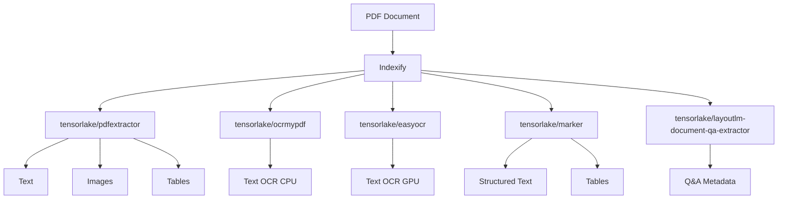
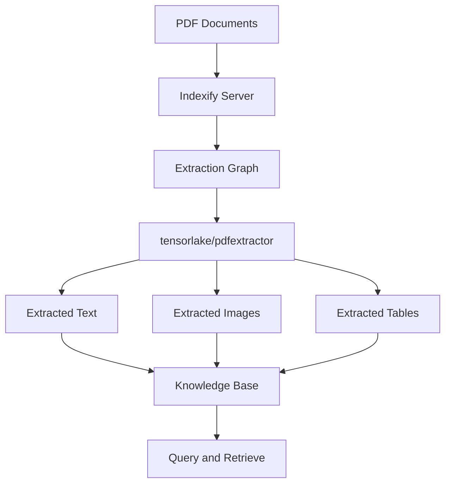
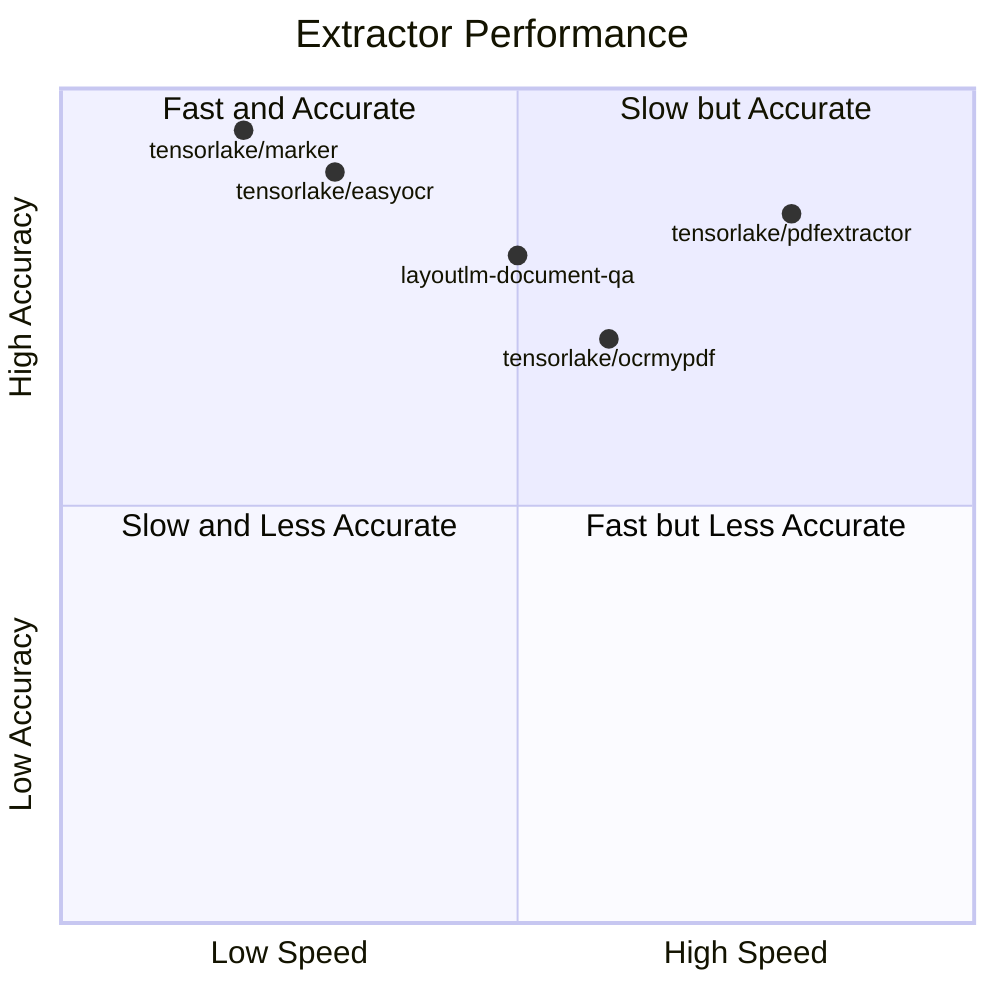

# Comprehensive Guide to PDF Extraction with Indexify

## Introduction

PDF (Portable Document Format) is a widely used file format for sharing documents. However, extracting useful information from PDFs can be challenging. This is where Indexify comes in. Indexify is a powerful tool that provides various extractors to help you extract text, images, and tables from PDF documents efficiently.

This guide will walk you through the process of using Indexify for PDF extraction, from basic concepts to advanced use cases. Whether you're a beginner just starting with PDF extraction or an experienced developer looking to optimize your workflow, this guide has something for you.

## Table of Contents

1. [What is Indexify?](#what-is-indexify)
2. [Getting Started with Indexify](#getting-started-with-indexify)
3. [Understanding PDF Extraction](#understanding-pdf-extraction)
4. [Indexify PDF Extractors](#indexify-pdf-extractors)
5. [End-to-End Example: Building a PDF Knowledge Base](#end-to-end-example-building-a-pdf-knowledge-base)
6. [Advanced Use Cases](#advanced-use-cases)
7. [Extractor Performance Analysis](#extractor-performance-analysis)
8. [Best Practices and Tips](#best-practices-and-tips)
9. [Conclusion](#conclusion)

## What is Indexify?

Indexify is a powerful tool designed to simplify the process of extracting and indexing information from various document types, with a particular focus on PDFs. It provides a suite of extractors that can handle different aspects of PDF content, including text, images, and tables.

### Key Features of Indexify

1. **Versatile Extraction**: Indexify can extract text, images, and tables from PDFs.
2. **Modular Architecture**: You can build complex pipelines by combining different extractors.
3. **Scalability**: Indexify is designed to handle large volumes of documents efficiently.
4. **Integration**: It can be easily integrated into existing workflows and applications.

## Getting Started with Indexify

To start using Indexify, follow these steps:

1. Install Indexify:
   ```bash
   curl https://getindexify.ai | sh
   ```

2. Start the Indexify server:
   ```bash
   ./indexify server -d
   ```

3. Install the Indexify Python client:
   ```bash
   pip install indexify
   ```

Now you're ready to start using Indexify in your projects!

## Understanding PDF Extraction

PDF extraction is the process of pulling out useful information from PDF files. This can include:

- **Text**: The main content of the document.
- **Images**: Any pictures or graphics in the PDF.
- **Tables**: Structured data presented in a tabular format.
- **Metadata**: Information about the document itself, such as author, creation date, etc.

Extracting this information can be challenging due to the complex structure of PDF files. Indexify simplifies this process by providing specialized extractors for each type of content.

## Indexify PDF Extractors

Indexify offers several extractors specifically designed for PDF documents. Here's an overview of the main ones:

1. **tensorlake/pdfextractor**: 
   - Extracts text, images, and tables
   - Best for scientific papers with tabular information

2. **tensorlake/ocrmypdf**: 
   - Focuses on text extraction
   - Ideal for photocopied or scanned PDFs (CPU-based)

3. **tensorlake/easyocr**: 
   - Also focuses on text extraction
   - Optimized for photocopied or scanned PDFs (GPU-based)

4. **tensorlake/marker**: 
   - Extracts text and tables
   - Best for detailed, structured, and formatted PDFs

5. **tensorlake/layoutlm-document-qa-extractor**: 
   - Specialized for question-answering tasks
   - Particularly useful for invoices and structured documents

Let's visualize how these extractors fit into an extraction pipeline:



This diagram shows how a PDF document can be processed by different Indexify extractors, each producing specific types of output.

## End-to-End Example: Building a PDF Knowledge Base

Let's walk through a complete example of how to use Indexify to build a PDF knowledge base. This example will demonstrate how to extract text, images, and tables from a set of PDF documents and store the extracted information for later use.

### Step 1: Set Up the Environment

First, make sure you have Indexify installed and the server running. Then, create a new Python script and import the necessary libraries:

```python
from indexify import IndexifyClient, ExtractionGraph
import os

# Initialize the Indexify client
client = IndexifyClient()
```

### Step 2: Define the Extraction Graph

Now, let's define an extraction graph that uses the `tensorlake/pdfextractor` to extract text, images, and tables from our PDFs:

```python
extraction_graph_spec = """
name: 'pdf_knowledge_base'
extraction_policies:
  - extractor: 'tensorlake/pdfextractor'
    name: 'pdf_extractor'
    input_params:
      output_types: ["text", "image", "table"]
"""

# Create the extraction graph
extraction_graph = ExtractionGraph.from_yaml(extraction_graph_spec)
client.create_extraction_graph(extraction_graph)
```

This graph will extract text, images, and tables from each PDF we process.

### Step 3: Process PDF Documents

Now, let's process a directory of PDF documents:

```python
pdf_directory = "/path/to/your/pdf/files"

for filename in os.listdir(pdf_directory):
    if filename.endswith(".pdf"):
        file_path = os.path.join(pdf_directory, filename)
        content_id = client.upload_file("pdf_knowledge_base", file_path)
        print(f"Uploaded {filename} with content ID: {content_id}")

        # Wait for extraction to complete
        client.wait_for_extraction(content_id)
```

### Step 4: Retrieve Extracted Content

After processing, we can retrieve the extracted content:

```python
def print_extracted_content(content_id):
    extracted_content = client.get_extracted_content(
        content_id=content_id, 
        graph_name="pdf_knowledge_base", 
        policy_name="pdf_extractor"
    )
    
    for content in extracted_content:
        if content.content_type == "text/plain":
            print("Extracted Text:")
            print(content.data.decode('utf-8')[:500] + "...")  # Print first 500 characters
        elif content.content_type.startswith("image/"):
            print(f"Extracted Image: {content.features[0].name}")
        elif "table" in content.features[0].name:
            print("Extracted Table:")
            print(content.features[0].value)

# Retrieve and print extracted content for each processed PDF
for content_id in client.list_content_ids("pdf_knowledge_base"):
    print(f"\nContent ID: {content_id}")
    print_extracted_content(content_id)
```

This script will print out a summary of the extracted content for each PDF, including the first 500 characters of text, names of extracted images, and any extracted tables.

### Step 5: Visualize the Extraction Process

Let's visualize our PDF knowledge base extraction process:



This diagram illustrates how PDF documents are processed through Indexify, extracted using the `tensorlake/pdfextractor`, and stored in a knowledge base for later querying and retrieval.

## Advanced Use Cases

Once you have extracted content from your PDFs, you can use it for various advanced applications:

1. **Document Search Engine**: Index the extracted text to create a searchable database of your PDFs.
2. **Image Analysis**: Process extracted images for tasks like object detection or classification.
3. **Data Analysis**: Use extracted tables for data analysis and visualization.
4. **Question Answering**: Combine extracted content with language models for automated question answering.

Here's a simple example of how you might use the extracted text for a basic search functionality:

```python
from indexify import IndexifyClient
from rapidfuzz import fuzz

client = IndexifyClient()

def search_pdfs(query, graph_name="pdf_knowledge_base", policy_name="pdf_extractor"):
    results = []
    for content_id in client.list_content_ids(graph_name):
        extracted_content = client.get_extracted_content(
            content_id=content_id, 
            graph_name=graph_name, 
            policy_name=policy_name
        )
        for content in extracted_content:
            if content.content_type == "text/plain":
                text = content.data.decode('utf-8')
                similarity = fuzz.partial_ratio(query.lower(), text.lower())
                if similarity > 70:  # Adjust this threshold as needed
                    results.append((content_id, similarity))
    
    return sorted(results, key=lambda x: x[1], reverse=True)

# Example usage
search_results = search_pdfs("machine learning")
for content_id, similarity in search_results[:5]:  # Top 5 results
    print(f"Content ID: {content_id}, Similarity: {similarity}")
```

This script implements a simple fuzzy search across all extracted text from your PDFs, returning the most relevant documents based on the search query.

## Extractor Performance Analysis

When choosing an extractor for your PDF processing needs, it's important to consider both accuracy and speed. Here's a comparison of the performance of different Indexify PDF extractors:

### Category: Scientific Papers and Books

1. [crowd.pdf](https://pub-5dc4d0c0254749378ccbcfffa4bd2a1e.r2.dev/crowd.pdf) - Reference: [crowd.md](https://raw.githubusercontent.com/tensorlakeai/indexify-extractors/main/pdf/benchmark/references/crowd.md) (10 pages)
2. [multicolcnn.pdf](https://pub-5dc4d0c0254749378ccbcfffa4bd2a1e.r2.dev/multicolcnn.pdf) - Reference: [multicolcnn.md](https://raw.githubusercontent.com/tensorlakeai/indexify-extractors/main/pdf/benchmark/references/multicolcnn.md) (10 pages)
3. [switch_trans.pdf](https://pub-5dc4d0c0254749378ccbcfffa4bd2a1e.r2.dev/switch_trans.pdf) - Reference: [switch_trans.md](https://raw.githubusercontent.com/tensorlakeai/indexify-extractors/main/pdf/benchmark/references/switch_trans.md) (40 pages)
4. [thinkdsp.pdf](https://pub-5dc4d0c0254749378ccbcfffa4bd2a1e.r2.dev/thinkdsp.pdf) - Reference: [thinkdsp.md](https://raw.githubusercontent.com/tensorlakeai/indexify-extractors/main/pdf/benchmark/references/thinkdsp.md) (153 pages)
5. [thinkos.pdf](https://pub-5dc4d0c0254749378ccbcfffa4bd2a1e.r2.dev/thinkos.pdf) - Reference: [thinkos.md](https://raw.githubusercontent.com/tensorlakeai/indexify-extractors/main/pdf/benchmark/references/thinkos.md) (99 pages)
6. [thinkpython.pdf](https://pub-5dc4d0c0254749378ccbcfffa4bd2a1e.r2.dev/thinkpython.pdf) - Reference: [thinkpython.md](https://raw.githubusercontent.com/tensorlakeai/indexify-extractors/main/pdf/benchmark/references/thinkpython.md) (240 pages)


### Scoring Methodology

The scoring was done by comparing the extracted text from each PDF with its reference text using the following steps:

1. **Chunking**: Both the hypothesis (extracted text) and the reference text are divided into chunks of 500 characters, ensuring chunks have a minimum of 25 characters.
2. **Overlap Score Calculation**: For each chunk of the hypothesis text, a fuzzy matching score with the best-matching reference chunk within a defined range is computed using the `rapidfuzz` library. This range is determined based on a length modifier and search distance.
3. **Final Score**: The average of these chunk scores provides a final alignment score between 0 and 1, indicating how closely the extracted text matches the reference.

### Extractor Performance

| Extractor                   | Accuracy | Speed | Best For                            |
|-----------------------------|----------|-------|-------------------------------------|
| tensorlake/pdfextractor     | High     | Fast  | General-purpose extraction          |
| tensorlake/ocrmypdf         | Medium   | Medium| Scanned documents (CPU-based)       |
| tensorlake/easyocr          | High     | Slow  | Scanned documents (GPU-based)       |
| tensorlake/marker           | Very High| Slow  | Detailed, structured PDFs           |
| layoutlm-document-qa        | High     | Medium| Question-answering tasks            |


### Accuracy Comparison

| PDF Document          | Marker Score | Unstructured IO Score | EasyOCR Score | OCRmyPDF Score | OpenAI GPT-4o Score |
|-----------------------|--------------|----------------------|----------------|-----------------|---------------------|
| crowd.pdf             | 0.5391       | 0.5224               | 0.5486         | 0.5792          | 0.5556              |
| multicolcnn.pdf       | 0.5409       | 0.5213               | 0.5333         | 0.5627          | 0.3981              |
| switch_trans.pdf      | 0.5191       | 0.4730               | 0.5198         | 0.5198          | 0.4358              |
| thinkdsp.pdf          | 0.6810       | 0.6625               | 0.6755         | 0.6740          | 0.6818              |
| thinkos.pdf           | 0.7368       | 0.6855               | 0.6781         | 0.7050          | 0.6813              |
| thinkpython.pdf       | 0.6910       | 0.6822               | 0.6875         | 0.6161          | 0.6666              |

### Time Taken Comparison

| PDF Document          | Marker Time (s) | Unstructured IO Time (s) | EasyOCR Time (s) | OCRmyPDF Time (s) | OpenAI GPT-4o Time (s) |
|-----------------------|-----------------|--------------------------|------------------|-------------------|------------------------|
| crowd.pdf             | 21.65           | 2.44                     | 14.18            | 5.44              | 722.21                 |
| multicolcnn.pdf       | 17.91           | 1.64                     | 31.00            | 22.40             | 182.97                 |
| switch_trans.pdf      | 45.90           | 5.35                     | 0.14             | 4.10              | 484.94                 |
| thinkdsp.pdf          | 139.80          | 29.10                    | 17.37            | 20.59             | 1256.39                |
| thinkos.pdf           | 84.04           | 4.88                     | 0.13             | 5.70              | 914.21                 |
| thinkpython.pdf       | 217.60          | 21.00                    | 4.03             | 13.96             | 4991.86                |

### Visual Comparison

| Accuracy Comparison | Time Taken Comparison |
|---------------------|------------------------|
|  |  |

Here's a quadrant chart diagram of the performance:



This chart provides a visual representation of how different extractors perform in terms of speed and accuracy. The ideal extractor would be in the top-right quadrant (Fast and Accurate).

### Reproduction Code for Comparison

| Resource | Link |
|----------|------|
| Code for Creating Graphs | [Google Colab](https://colab.research.google.com/drive/1xyS8oCJV1CHW5fmgeD3umSAPbGOqID-G?usp=sharing) |
| Benchmarking Notebook | [Google Colab](https://colab.research.google.com/drive/16U8ll_oa55jLJgRbdbp2i7NKPmuUb7Gb?usp=sharing) |
| Benchmarking Local Script | [GitHub Repository](https://github.com/tensorlakeai/indexify-extractors/tree/main/pdf/benchmark) |
| Extractor Performance Benchmarks | [Marker GitHub Repository](https://github.com/VikParuchuri/marker?tab=readme-ov-file#benchmarks) |

Note: Thanks to the Marker team for the code used in the Extractor Performance Benchmarks.

## Best Practices and Tips

1. **Choose the Right Extractor**: Select the extractor that best fits your specific use case and document types.
2. **Preprocess Your PDFs**: Ensure your PDFs are of good quality. For scanned documents, consider using OCR-specific extractors.
3. **Handle Errors Gracefully**: Some PDFs may fail to process. Implement error handling to manage these cases.
4. **Monitor Performance**: Keep an eye on processing times and accuracy, especially when dealing with large volumes of documents.
5. **Post-process Extracted Content**: Clean and format extracted text, validate table structures, and optimize images as needed.
6. **Implement Caching**: For frequently accessed documents, consider caching extracted content to improve response times.

## Explore More Examples

We've curated a collection of PDF extraction examples. Check out these notebooks:

- [Translation (Uses OpenAI)](../../example_code/pdf/openai_pdf_translation)
- [Summarization (Uses Mistral)](../../example_code/pdf/mistral/pdf-summarization)
- [Entity Extraction (Uses Mistral)](../../example_code/pdf/mistral/pdf-entity-extraction)
- [Chunk Extraction (Uses LangChain)](../../example_code/pdf/chunking)
- [Indexing and RAG (Uses OpenAI)](../../example_code/pdf/rag)
- [Structured Extraction guided by Schema (Uses OpenAI)](../../example_code/pdf/schema)


## Conclusion

Indexify provides a powerful and flexible solution for PDF extraction, enabling you to build sophisticated document processing pipelines. By understanding the capabilities of different extractors and following best practices, you can efficiently extract valuable information from your PDF documents and use it in a wide range of applications.

### Recommendation of Extractors

| Aspect | Extractor | Class Name | Analysis |
|--------|-----------|------------|----------|
| Accuracy | Marker | tensorlake/marker | Consistently provides high accuracy scores across all PDF documents. |
| | EasyOCR | tensorlake/easyocr | Shows competitive accuracy across all the documents. |
| | OCRMyPDF | tensorlake/ocrmypdf | Shows competitive accuracy across all the documents. |
| | Unstructured IO | tensorlake/pdfextractor | Is fractionally better than EasyOCR in one of the books, and from OCRMyPDF on another. |
| | OpenAI GPT-4o | tensorlake/openai | Performs well for code-based texts however it performs average for regular texts. |
| Time Efficiency | Unstructured IO | tensorlake/pdfextractor | Is the fastest, taking the least time for all PDF documents. |
| | EasyOCR | tensorlake/easyocr | Shows extreme variability in processing times, being exceptionally fast for some documents and very slow for others. |
| | Marker | tensorlake/marker | Despite providing high accuracy, is significantly slower compared to the other extractors. |
| | OCRmyPDF | tensorlake/ocrmypdf | Shows moderate time efficiency, balancing between speed and accuracy. |
| | OpenAI GPT-4o | tensorlake/openai | Takes by far the longest time and is best avoided for pdf extraction unless necessary. |
| Recommendations | Marker | tensorlake/marker | Use when accuracy is the primary concern and processing time is less critical. Ideal for scenarios requiring detailed and precise text extraction. |
| | EasyOCR | tensorlake/easyocr | When accuracy is important, but you need faster extraction time. EasyOCR also provides training recipes to fine-tune the model on private documents. This will improve its accuracy further. |
| | Unstructured IO | tensorlake/pdfextractor | While unstructured doesn't show any significant advantages in accuracy, it is known to handle a lot of different variations of PDFs. |

Remember, the key to successful PDF extraction is choosing the right tools for your specific needs and continuously refining your process. Experiment with different extractors and configurations to find the optimal setup for your use case.

Happy extracting!
