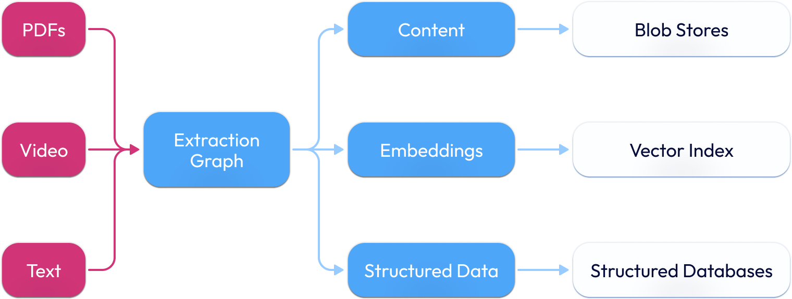

The core idea is to build ingestion pipelines with stages that transforms unstructured data, and perform structured extraction or create embeddings using AI models.

The core idea is to build represent data-intensive AI workflows as graphs, where each node is a function which operates on data, and edges represent data flow between functions. 


 
## Graphs
These are multi-step workflows created by connecting multiple functions together.

* Graphs have a start node, which is the first funciton that is executed when the graph is invoked.

* Graphs have edges which represent data flow between functions.

* There are conditional edges as well, which evaluate input data from the previous function and decide which edges to take. They are like if-else statements in programming.

## Functions

Functions, are no different than regular Python functions, except that they are decorated with `@indexify_function()` decorator. 

The decorator indicates that the function can be executed in a distributed manner, and the output is stored so that if downstream functions fail, they can be resumed from the output of the function.
There are various other parameters, in the decorator that can be used to configure retry behaviour, placement constraints, and more.

## Namespaces

Namespaces as logical abstractions for storing related content. This allows for effective data partitioning based on security requirements or organizational boundaries.

## Programming Model


#### Map
Map-Reduce is a programming model for processing and generating large data sets with a parallel, distributed algorithm on a cluster.

When a function returns a sequence, List[T] - and if a downstream function accepts only a single element of the sequence, the function is automatically parallelized across multiple machines.
```python
@indexify_function()
def fetch_urls(num_urls: int) -> list[str]:
    return [
        'https://example.com/page1',
        'https://example.com/page2',
        'https://example.com/page3',
    ]

# scrape_page is called in parallel for every element of fetch_url across
# many machines in a cluster or across many worker processes in a machine
@indexify_function()
def scrape_page(url: str) -> str:
    content = requests.get(url).text
    return content
```
*Use Cases:* Generating Embedding from every single chunk of a document.

#### Reducing/Accumulating from Sequences

Reduce Functions are the inverse of Map functions. They are invoked as Map functions finish, and they aggregate the outputs of the Map functions.

```python
@indexify_function()
def fetch_numbers() -> list[int]:
    return [1, 2, 3, 4, 5]

class Total(BaseModel):
    value: int = 0

@indexify_function(accumulate=Total)
def accumulate_total(total: Total, number: int) -> Total:
    total.value += number
    return total
```
*Use Cases:* Aggregating a summary from hundreds of web pages.


#### Dynamic Routing

Functions can route data to different nodes based on custom logic, enabling dynamic branching.

```python
@indexify_function()
def handle_error(text: str):
    # Logic to handle error messages
    pass

@indexify_function()
def handle_normal(text: str):
    # Logic to process normal text
    pass

# The function routes data into the handle_error and handle_normal based on the
# logic of the function.
@indexify_router()
def analyze_text(text: str) -> List[Union[handle_error, handle_normal]]:
    if 'error' in text.lower():
        return [handle_error]
    else:
        return [handle_normal]
```

*Use Cases:* Use Case: Processing outputs differently based on classification results.

## How does Indexify Fit into LLM Applications?

Indexify sits between data sources and your application. It will keep ingesting new data, run Graphs to keep your databases updated. LLM applications can query the databases whenever they need to. A typical workflow we see - 

  1. Uploading unstructured data (documents, videos, images, audio) to pipelines
  2. Graphs extracts information and updates vector indexes and structured stores
  3. Retrieving information via semantic search on vector indexes and SQL queries on structured data tables